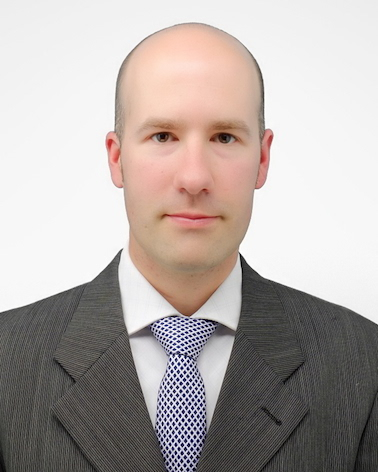

トッド　パタキ
===================================

I am an Associate Professor in the Department of Biongineering at Shinshu University (Ueda, Nagano, Japan)
and Director of the :ref:`Applied Biomechanics Laboratory <label-Home>`.
I received a Ph.D. in Kinesiology and Mechanical Engineering from Penn State University (USA) in 2004.
I'm originally from Toronto, Canada.

Research theme
--------------------

My research focusses on the analysis and simulation of **stochastic processes in biomechanical systems**.
I am especially interested in objective analyses of spatiotemporally complex biomechanical continua.
Together with a team of student researchers and collaborators I am actively utilizing this fundamental statistical and computational theory in a number of Human Biomechanics applications including: gait analysis, sports performance assessment, and probabilistic finite element simulations.

Software
--------------------

I am the main developer and maintainer of two open-source software packages:

- `spm1d <http://www.spm1d.org>`_: One-Dimensional Statistical Parametric Mapping
- `rft1d <http://www.spm1d.org/rft1d>`_: One-Dimensional Random Field Theory (coming soon)

I use the following free-and-open-source software:

- `Python <http://www.python.org>`_
- `Blender <http://www.blender.org>`_
- `FEBio <http://www.febio.org>`_
- `OpenSim <http://opensim.stanford.edu>`_

I'm also proficient with the following commercial software:

- MATLAB
- LabView
- ABAQUS

Curriculum Vitae
--------------------

- :download:`Download PDF <./downloads/ToddPatakyCV.pdf>`

